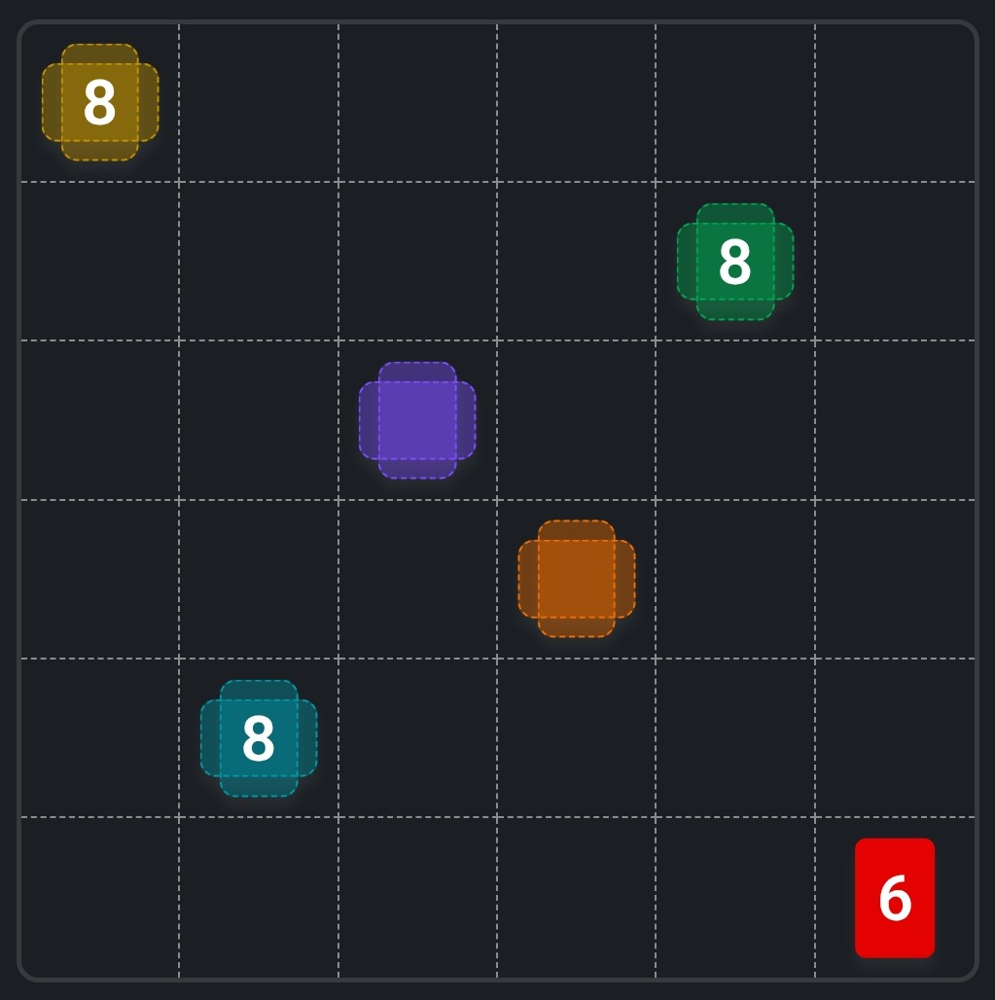
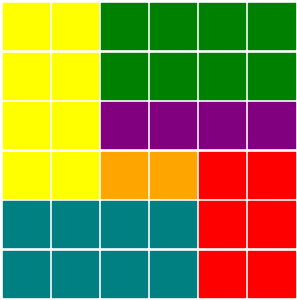

<div align="center">
    
</div>

# 🐍𖣯 LinkedIn Games Solvers

LinkedIn Games is a Python library that provides a set of tools to solve LinkedIn board games ([Queens][linkedin-queens], [Tango][linkedin-tango], [Zip][linkedin-zip], [Mini Sudoku][linkedin-mini-sudoku] and [Patches][linkedin-patches] for now) by using Linear Optimization models. This library leverages popular Python libraries such as [Pyomo] for mathematical modeling and [NetworkX] for graph-based representations of game boards.

This repository also contains a Jupyter Book that serves as a comprehensive guide to understanding and solving LinkedIn games using the LinOptIn Games library. The book covers various topics, including the basics of optimization, the model structure of LinkedIn games, and step-by-step tutorials for solving them by using linear optimization.

[linkedin-queens]: https://www.linkedin.com/games/queens/
[linkedin-tango]: https://www.linkedin.com/games/tango/
[linkedin-zip]: https://www.linkedin.com/games/zip/
[linkedin-mini-sudoku]: https://www.linkedin.com/games/mini-sudoku/
[linkedin-patches]: https://www.linkedin.com/games/patches/
[Pyomo]: https://www.pyomo.org/
[NetworkX]: https://networkx.org/en/

# Installing

To install the LinkedIn Games library, you can use `pip`:

```bash
pip install linkedin-games
```

Or run this command if you use `uv` as your project's environment manager (which I personally recommend):

```bash
uv add linkedin-games
```

# A Simple Example

In order to solve this Patches game:

<div align="center">
    
</div>

One can run this simple code snippet.

```python
from linkedin_games import Patches


seeds = {
    (1,1): {"color": "yellow", "area"=8},
    (2,5): {"color": "green",  "area"=8},
    (3,3): {"color": "purple"},
    (4,4): {"color": "orange"},
    (5,2): {"color": "teal",   "area"=8},
    (6,6): {"color": "red",    "area"=6, "shape"="vertical"}
}
patches = Patches((6, 6), seeds)
patches.solve()
patches.show()
```

Which will return the following result:

<div align="center">
    
</div>

Which, by its turn, matches the official solution of this game:

<div align="center">
    
</div>

# 📙 Jupyter Book

You can read more about the usage and implementation of this library on this [Jupyter Book].

[Jupyter Book]: https://rodrigo-cl-porto.github.io/linkedin-games-solvers/

## Table of Contents

- Solving Linkedin Games by Linear Optimization
    - [Home][home]
- Getting Started
    - [What is Optimization?][what-is-optimization]
    - [LinkedIn Games Library][linkedin-games-library]
- How to Solve
    - [Queens][how-to-solve-queens]
    - [Tango][how-to-solve-tango]
    - [Zip][how-to-solve-zip]
    - [Mini Sudoku][how-to-solve-mini-sudoku]
    - [Patches][how-to-solve-patches]

[home]: https://rodrigo-cl-porto.github.io/linkedin-games-solvers/
[what-is-optimization]: https://rodrigo-cl-porto.github.io/linkedin-games-solvers/getting-started/what-is-optimization/
[linkedin-games-library]: https://rodrigo-cl-porto.github.io/linkedin-games-solvers/getting-started/linkedin-games-library/
[how-to-solve-queens]: https://rodrigo-cl-porto.github.io/linkedin-games-solvers/how-to-solve/queens/
[how-to-solve-tango]: https://rodrigo-cl-porto.github.io/linkedin-games-solvers/how-to-solve/tango/
[how-to-solve-zip]: https://rodrigo-cl-porto.github.io/linkedin-games-solvers/how-to-solve/zip/
[how-to-solve-mini-sudoku]: https://rodrigo-cl-porto.github.io/linkedin-games-solvers/how-to-solve/mini-sudoku/
[how-to-solve-patches]: https://rodrigo-cl-porto.github.io/linkedin-games-solvers/how-to-solve/patches/
